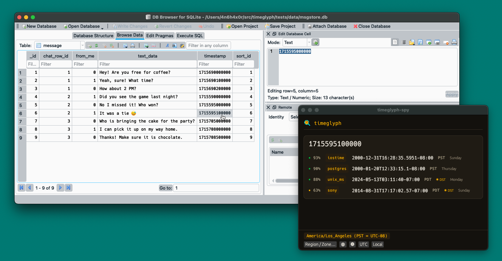

<p align="center">
  
</p>

# timeglyph

[](https://crates.io/crates/timeglyph)
[](https://docs.rs/timeglyph)
[](LICENSE)
[](https://github.com/SecurityRonin/timeglyph/actions/workflows/ci.yml)
[](https://github.com/SecurityRonin/timeglyph/releases)
[](https://github.com/sponsors/h4x0r)

**Decode any timestamp. Identify the unknown ones. See time itself.**

Every examination throws raw timestamps at you — a `133801920000000000` buried in
an artifact — that you need in human-readable time. `timeglyph` reads that value
every way a system might have written it and reports the results **ranked, scored,
and cited** — honest about the ambiguity instead of guessing one answer. Convert
in bulk from a CSV, hover the number on screen and read the time live, or lay a
month out as a **forensic calendar** — DST fold/gap days, leap seconds, GPS week,
format epochs, and the moon's phase, all flagged. No more copying each value into a
converter app. One static Rust binary, plus a live overlay that decodes whatever is
under your cursor.

**[Try it in your browser →](https://securityronin.github.io/timeglyph/playground.html)** · **[Full documentation →](https://securityronin.github.io/timeglyph/)**

The playground runs the real engine as WebAssembly, entirely client-side — paste a value, see every ranked, cited reading; nothing leaves the page.

```console
$ timeglyph 1577836800
# readings consistent with 1577836800 (ranked; a raw value is usually underdetermined — not a single verdict):
  [1.00] unix           2020-01-01T00:00:00Z  (Unix time (seconds))
  [0.94] postgres       2000-01-01T00:26:17.8368Z  (PostgreSQL timestamp (µs since 2000))
  [0.67] cocoa          2051-01-01T00:00:00Z  (Cocoa / CFAbsoluteTime (s since 2001))
  [0.67] hfsplus        1953-12-31T00:00:00Z  (Apple HFS+ (s since 1904))
  ...
```

---

## Install

**macOS**
```bash
brew install securityronin/tap/timeglyph
```

**Debian / Ubuntu**
```bash
curl -1sLf 'https://dl.cloudsmith.io/public/securityronin/timeglyph/setup.deb.sh' | sudo -E bash
sudo apt install timeglyph
```

**Windows**
```powershell
winget install SecurityRonin.timeglyph
```

**Cargo**
```bash
cargo install timeglyph
```

On macOS and Windows this also installs the
[`timeglyph-lens`](#timeglyph-lens--hover-anything-decode-time-data) overlay.

---

## What you do with it

### Identify an unknown value

```bash
timeglyph 1577836800                    # ranked, scored readings across every format
timeglyph identify --json 1577836800    # same, machine-readable
timeglyph --as hex 0060947C58B2D501     # raw bytes only: little/big-endian + packed on-disk
timeglyph --as string 20200101000000Z   # string forms only: ISO / RFC 2822 / ASN.1
```

Exit codes are pipeline-safe: `0` clear top reading, `2` ambiguous or a sentinel
(review needed), `1` error. Render in any timezone with `--tz` (`UTC`, a fixed
offset, or a DST-correct IANA name); nudge readings toward a source family with
`--artifact "<hint>"`.

### Decode or encode a known format

```bash
timeglyph decode filetime 132223104000000000
timeglyph decode fat 1545691136          # FAT/DOS packed date+time (LOCAL) — one of 45 formats
timeglyph encode unix 2020-01-01T00:00:00Z
timeglyph explain filetime               # a spec card: epoch, tick, tz/leap, range, sentinels, citation
timeglyph list                           # the format registry, with spec citations
```

### Mine artifacts at scale

```bash
timeglyph scan app.log                  # find & decode every timestamp in text (or stdin)
timeglyph carve aabbcc… --from 2015 --to 2026 --json   # carve timestamps at every byte offset
timeglyph csv events.csv                # enrich a CSV with human-readable timestamp columns
```

Convert in bulk: enrich a whole CSV of timestamps in one pass instead of pasting
them into a converter one at a time. `carve` sweeps a raw blob (a config, a
record, a hex selection) for timestamps at every offset — window- and
score-thresholded — and exports JSONL, ImHex bookmarks, or Timesketch events.

[CSV enrichment →](docs/csv.md)

### See time itself — the forensic calendar

```bash
timeglyph cal                     # this month, with DST/leap/epoch markers
timeglyph cal 2026-11 --tz America/New_York   # DST fold/gap days flagged
timeglyph cal 2026-09-18          # one day in full: week/epoch systems + a moon disc
timeglyph cal 2026 --json         # a whole year, faithful per-day records
```

`cal` is a calendar built for temporal analysis: per-day UTC offset and DST
fold/gap days, leap-second days and GPS week, ISO week / Julian Day / Unix,
timestamp-format epoch and rollover markers, seven alternative calendars (Chinese
lunisolar with the 干支 four pillars, plus ROC, Japanese, Buddhist, Hebrew, Islamic,
and Persian), and the moon's phase — every value computed and oracle-validated
(`date`, `zdump`, USNO, IERS, JPL).

[The forensic calendar →](docs/cal.md)

### Use it from an LLM / agent

```bash
timeglyph mcp                           # a Model Context Protocol stdio server
```

`mcp` exposes `identify` / `decode` / `explain` as MCP tools, so an LLM-driven
DFIR workflow gets a cited, reproducible reading instead of a hallucinated epoch
conversion.

---

## TimeGlyph Lens — hover anything, decode time data

Convert live: hover any number on screen and read its time in real time. An
always-on-top overlay follows your cursor and shows timeglyph's ranked readings
for the number in the UI element under the pointer, so you never copy a value into
a converter. Each row carries its confidence, the weekday, and the public holiday
for that date in the chosen zone. Pick any display timezone from the footer.

<p align="center">
  
</p>

It installs with the CLI on macOS and Windows and reads the element under the
cursor through the platform accessibility layer — the Accessibility API on macOS,
UI Automation on Windows. (Linux support is in progress.)

[Overlay guide →](docs/lens.md)

---

## Formats

`timeglyph` decodes and auto-identifies **45 registered formats** plus the
self-describing string forms:

- **Epoch integers & floats** — Unix (s/ms/µs/ns and `double`), FILETIME (incl.
  Active Directory / LDAP), WebKit/Chrome, Cocoa / CFAbsoluteTime (integer, signed
  double, iOS-11 ns), Apple HFS+/HFS, .NET ticks, OLE automation, Excel-1904,
  PostgreSQL, Mozilla PRTime, SQLite Julian day, DHCPv6, Modified Julian Day
- **Embedded IDs** — KSUID, ULID, UUIDv1 / v6 / v7, MongoDB ObjectId, GMail message
  IDs, and Snowflake-class IDs (Twitter/X, Discord, Mastodon, LinkedIn, TikTok, Sonyflake)
- **Packed & mobile/broadcast** — FAT/DOS and exFAT date-time words, 128-bit
  SYSTEMTIME structs, Microsoft DTTM, BCD, GSM 7-byte semi-octet, Nokia, DVR,
  Motorola, Symantec, and SQL Server DATETIME
- **Strings** — ISO 8601 / RFC 3339, RFC 2822 email dates, EXIF, ASN.1
  GeneralizedTime & UTCTime
- **Leap-aware scales** (`--features leap`) — GPS, TAI64, NTP, kept separate from
  the POSIX spine

Every reading names the spec it assumes and is scored on window membership,
granularity, magnitude, byte-width, endianness, artifact context, and neighbour
monotonicity. Correctness is checked against primary-spec worked examples and the
MIT [`time_decode`](https://github.com/digitalsleuth/time_decode) oracle — see
[validation](docs/validation.md).

---

## Why another converter?

Good ones exist ([`time_decode`](https://github.com/digitalsleuth/time_decode),
MIT; DCode, proprietary). `timeglyph` is a single static Rust binary built on a
**rigorous, cited model** where a reading is *evidence, not a verdict*: a
POSIX-correct internal spine (never mislabelled UTC), the leap-second family kept
separate, and **ambiguity as first-class, scored output**. Calendar and timezone
math is reused (`jiff`), never reinvented. See
[the design decisions](docs/decisions/).

---

[Privacy Policy](https://securityronin.github.io/timeglyph/privacy/) · [Terms of Service](https://securityronin.github.io/timeglyph/terms/) · © 2026 Security Ronin Ltd
