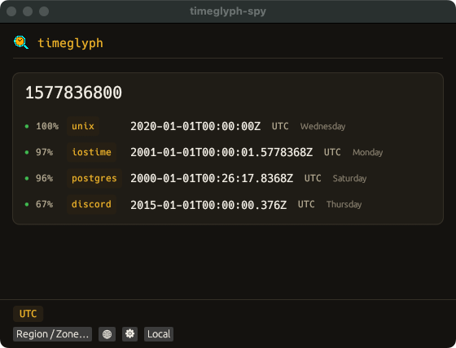

# timeglyph-spy — the cursor overlay

`timeglyph-spy` is the interactive front-end to the [timeglyph](index.md) engine.
It is an always-on-top window that follows your cursor and shows timeglyph's
ranked readings for any number in the UI element under the pointer — no
copy-paste, no switching windows. Point at a Unix time in a log, a FILETIME in a
registry viewer, or a column in a database browser, and the decodings appear.

<p align="center">
  
</p>

## What each reading shows

Every candidate is a row in a compact instrument panel:

- **Confidence** — a red/amber/green dot and a percentage from the engine's
  plausibility score (the same scoring as the CLI; hover for the component
  breakdown).
- **Format** — the amber chip (e.g. `unix`, `webkit`, `cocoa`); hover for the full
  format name.
- **Instant** — rendered in the chosen display timezone.
- **Weekday** — the day of week of the shown date.
- **Public holiday** — if that date is a public holiday in the display zone's
  country, its name (see [Public holidays](holidays.md)). Only for a named IANA
  zone; *consistent with* a holiday, an annotation, not proof.
- **干支 pillars** (opt-in) — the Chinese lunisolar date and the four
  Heavenly-Stem / Earthly-Branch pillars, stems over branches, each spot-colored
  by its 五行 (Five Element), with the day branch ringed. Enable it in Settings.

<p align="center">
  
</p>

## Display timezone

The footer selects how instants are rendered: **UTC** (the default), **Local**,
a **fixed offset** or IANA zone via **Region / Zone…**, or a click on the **🌐**
world map. UTC-anchored readings shift into the chosen zone (with an explicit
offset); naive wall-clock readings are shown as-is and tagged *local time (not
time-zone adjusted)*. The zone is session-scoped and never persisted — a prior
case's zone can't silently carry into the next launch.

## Settings

The **⚙** button (and, on macOS, the ⌘, menu item) opens Settings:

- **Theme** — dark (default) or light; both palettes clear WCAG AA.
- **Chinese lunisolar / 干支** — turns on the 干支 pillars and the longitude
  input (which refines only the hour pillar to true solar time).

## Platforms & permissions

| Platform | Status | Picker |
|---|---|---|
| macOS | supported | Accessibility API (`AXUIElementCopyElementAtPosition`) |
| Windows | supported | UI Automation (`IUIAutomation::ElementFromPoint`) |
| Linux | not supported | no picker backend |

On macOS the picker narrows to the exact word under the cursor; on Windows it
reads the hovered element's name. **Grant Accessibility permission on first
launch** (macOS: System Settings → Privacy & Security → Accessibility).

## Install

A single install brings both the `timeglyph` CLI and the `timeglyph-spy` overlay:

- **Windows:** `winget install SecurityRonin.timeglyph`.
- **macOS:** `brew install securityronin/tap/timeglyph`.

Or download the `timeglyph-spy` binary from the
[latest release](https://github.com/SecurityRonin/timeglyph/releases/latest), or
build from source:

```bash
cargo build --release --manifest-path spy/Cargo.toml
```

Grant Accessibility permission on first launch.
